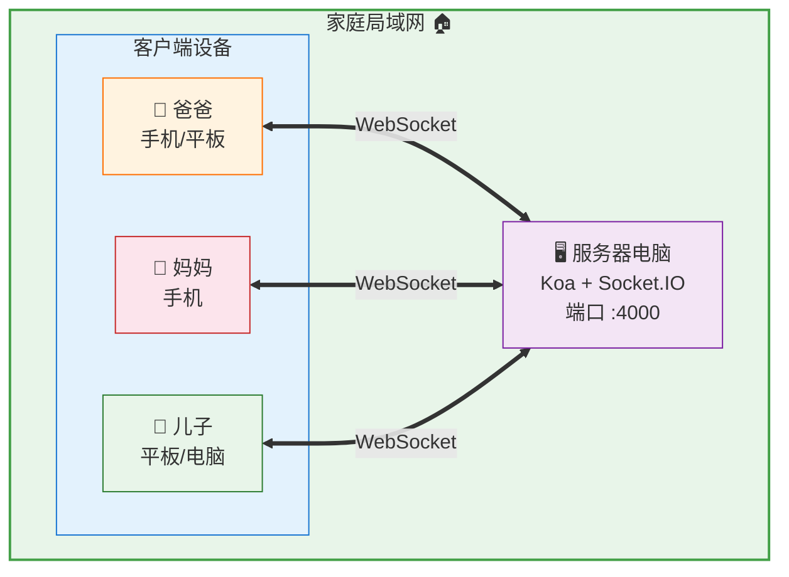
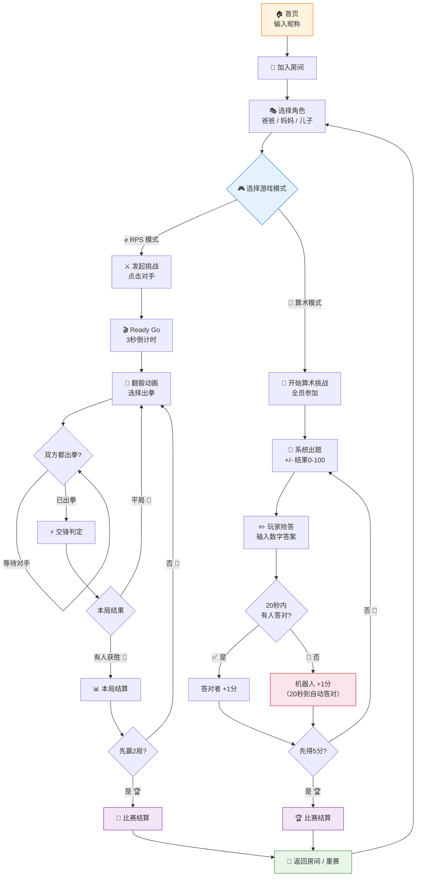

# Family War 🎮 v2.0

一个线上多人游戏系统，支持**石头剪刀布**（1v1 对战）和**算术达人**（全员抢答）两种玩法，以及和机器人对局。

## 系统架构



- 家人通过手机、平板或电脑的浏览器打开游戏页面（端口 3000）
- 所有设备通过家庭局域网连接到服务器电脑（端口 4000）
- 服务端运行 Koa HTTP 服务 + Socket.IO 实时通信
- 当前版本仅在局域网内使用，不发布互联网

## 游戏流程



### 数据流向说明

```
┌─────────────────┐         Socket.IO          ┌──────────────────┐
│  客户端 A (👨)   │ ◄────────────────────────► │                  │
│  浏览器 :3000    │                            │  服务端 🖥️       │
│                 │  事件驱动双向通信            │  Koa :4000       │
│  客户端 B (👩)   │ ◄────────────────────────► │  Socket.IO       │
│  浏览器 :3000    │                            │                  │
│                 │  广播/单播/房间              │  内存状态        │
│  客户端 C (👦)   │ ◄────────────────────────► │  roomManager     │
│  浏览器 :3000    │                            │  gameManager     │
└─────────────────┘                            └──────────────────┘

       用户操作 → emit 事件          事件推送 → 更新UI
      (挑战/出拳/答题)              (state/roundResult/matchResult)
```

1. **用户操作** → 客户端 `socket.emit()` 发送事件到服务端
2. **服务端处理** → 更新内存状态（房间/角色/游戏），执行判定逻辑
3. **状态推送** → 服务端 `io.to(room).emit()` 或 `socket.emit()` 推送结果
4. **UI 更新** → 客户端收到事件后更新 React 组件状态，驱动界面变化

全部游戏状态在服务端内存中，客户端只做展示和操作输入，**服务端是唯一可信源**。

## 技术栈

| 层 | 技术 |
|------|------|
| 前端 | React + react-app-rewired + Antd + JS |
| 后端 | Koa + @koa/router + JS |
| 实时通信 | Socket.IO（模块级单例，不依赖 React 生命周期） |
| UI 库 | Antd v5 |
| 测试框架 | Jest + React Testing Library |
| 测试策略 | TDD（先写测试后实现） |
| 管理接口 | Koa REST 路由 |
| 数据库 | 无（纯内存） |

## 目录结构

```
family-war/
├── client/                                   # React 前端 (端口 3000)
│   ├── public/
│   │   ├── favicon.svg
│   │   ├── logo.svg
│   │   └── index.html
│   ├── src/
│   │   ├── __tests__/
│   │   │   ├── Home.test.js                   # 首页 TDD 测试 (5 个)
│   │   │   ├── Room.test.js                   # 房间页 TDD 测试 (9 个)
│   │   │   ├── RoleCard.test.js               # 角色卡片 TDD 测试 (7 个)
│   │   │   └── Admin.test.js                  # 后台页 TDD 测试 (3 个)
│   │   ├── pages/
│   │   │   ├── Home.js                        # 首页：输入昵称（纯 UI，无 socket/routing）
│   │   │   ├── Room.js                        # 房间页：选角色、挑战、对战（纯 props 组件）
│   │   │   └── Admin.js                       # 后台：房间状态 + 对局记录
│   │   ├── components/
│   │   │   ├── RoleCard.js                    # 角色卡片（空闲/选中/对战中）
│   │   │   ├── GameBoard.js                   # RPS 对战面板（石头剪刀布按钮）
│   │   │   ├── ArithmeticBoard.js             # 算术达人面板（v2.0 新增）
│   │   │   ├── MatchResult.js                 # 结算弹窗（v2.0 拆为 RpsMatchResult + ArithmeticMatchResult 子组件）
│   │   │   └── ArithmeticMatchResult.js       # 算术结算（v2.0 新增）
│   │   ├── hooks/
│   │   │   ├── __mocks__/
│   │   │   │   └── useSocket.js               # Socket mock（测试用）
│   │   │   └── useSocket.js                   # Socket.IO 模块级单例
│   │   ├── setupProxy.js                      # CRA 代理 /api → :4000
│   │   ├── setupTests.js                      # Jest 全局配置 + matchMedia mock + 抑制 React Router 警告
│   │   ├── App.js                             # GameApp 容器，state 控制 Home/Room 切换
│   │   └── index.js
│   ├── jsconfig.json
│   ├── config-overrides.js
│   └── package.json
├── server/                         # Koa 后端 (端口 4000)
│   ├── __tests__/
│   │   ├── roomManager.test.js     # roomManager 单元测试 (24 个)
│   │   └── gameManager.test.js     # gameManager 单元测试 (22 个)
│   ├── tests/
│   │   └── integration.js          # 集成测试 (21 个断言)
│   ├── src/
│   │   ├── index.js                # Koa + Socket.IO 启动入口
│   │   ├── socket/
│   │   │   ├── handler.js          # 事件注册路由
│   │   │   ├── roomManager.js      # 房间/角色状态管理（内存）
│   │   │   └── gameManager.js      # 猜拳判定 + 三局两胜 + 断线处理
│   │   └── routes/
│   │       └── admin.js            # Koa REST 管理接口
│   ├── jsconfig.json               # VSCode JS 类型提示
│   └── package.json
└── package.json                    # 顶层 concurrent 启动
```

## 前端架构

```
App (BrowserRouter)
├── /admin → Admin
└── * → GameApp (状态容器)
    ├── roomState = null  →  Home
    │   └── onEnter(nickname) → emit room:join → setRoomState
    └── roomState ≠ null  →  Room
        ├── 选角色 / 切换游戏模式 (RPS / 算术)
        ├── gameType === 'rps'        → GameBoard → RpsMatchResult
        ├── gameType === 'arithmetic' → ArithmeticBoard → ArithmeticMatchResult
        └── onBack() → setRoomState(null) 返回首页
```

- Home 和 Room 之间没有 URL 切换，由 `GameApp` 的 state 控制渲染
- 刷新页面时 state 丢失，回退到 Home 界面，不产生死页面
- `socket.io` 客户端是模块级单例，不受 React 生命周期影响

## 游戏流程

### 石头剪刀布（v1.0）

```
首页(输入昵称) → 进入房间 → 选择角色 → 挑战 → Ready Go(首局) → 翻骰动画 → 出拳 → 结算
```

| 步骤 | 行为 | 通讯 |
|------|------|------|
| 进入房间 | 输入昵称，加入默认房间，开始播放大厅 BGM | `socket.emit('room:join', { nickname })` |
| 选角色 | 点击 爸爸/妈妈/儿子 角色卡，伴有选中/取消音效 | `socket.emit('role:select', { role })` |
| 发起挑战 | 选角后点击 ⚔️ 挑战按钮，伴有冲锋号角音效 | `socket.emit('game:challenge', { mode: 'rps', targetId })` |
| Ready Go | 比赛首局播放 3 秒倒计时动画，切换到对战 BGM | 客户端本地动画 |
| 翻骰动画 | 出拳阶段上方滚筒轮换 ✊✋✌️，伴有翻骰节拍音效 | 客户端本地动画 |
| 双方出拳 | 点击出拳按钮，滚筒定格 + punch 音效 → 交锋动画展示结果 | `socket.emit('game:move', { choice })` |
| 判定结果 | 服务器比对，广播本局结果 | 客户端收到 `game:roundResult` |
| 赛果 | 先赢 2 局者胜，切换到结算 BGM | 客户端收到 `game:matchResult` |

### 算术达人（v2.0）

```
选角色 → 切换算术模式 → 开始算术挑战 → 出题 → 抢答 → 结算
```

| 步骤 | 行为 | 通讯 |
|------|------|------|
| 切换模式 | 在房间内点击 "算术达人" 模式切换 | `socket.emit('game:setMode', { mode: 'arithmetic' })` |
| 开始游戏 | 点击 🧮 开始算术挑战按钮（需至少 1 人已选角色） | `socket.emit('game:challenge', { mode: 'arithmetic' })` |
| 出题 | 所有参战玩家收到算术题（+/-，结果 0-100） | 客户端收到 `game:question` |
| 抢答 | 在输入框中填写答案并提交 | `socket.emit('game:answer', { questionId, answer })` |
| 判定 | 首位答对者得 1 分；机器人固定 20 秒后自动答对 | 客户端收到 `game:roundResult` |
| 赛果 | 先得 5 分者胜，切换到结算 BGM | 客户端收到 `game:matchResult` |

## 游戏规则

### 石头剪刀布

| 规则 | 内容 |
|------|------|
| 赛制 | 三局两胜（先赢 2 局者获胜） |
| 挑战 | 选角后点击下方 ⚔️ 挑战按钮 → 直接开始，无确认弹窗 |
| 平局 | 该局无效，双方不得分，继续下一局直到出现赢家 |
| 断线 | 立即结束比赛，整场比赛结果无效，双方回到房间空闲状态 |
| 记分 | 不计分，纯判定胜负 |

### 算术达人

| 规则 | 内容 |
|------|------|
| 参赛 | 所有已选角色的人类玩家 + 机器人，全员参加 |
| 题目 | 随机 +/- 计算题，结果范围 0-100，标准难度 |
| 答题 | 数字输入框填写答案，提交后不可修改 |
| 抢答 | 首位答对者得 1 分，其余玩家不得分 |
| 机器人 | 固定 20 秒后自动提交正确答案，若 20 秒内无人答对则机器人得 1 分 |
| 赛制 | 先得 5 分者获胜，游戏结束 |
| 断线 | 玩家断线不影响算术游戏继续（仍在局中不扣分） |

### 通用规则

| 规则 | 内容 |
|------|------|
| 房间 | 默认 `default`，后期支持多房间（设计预留 roomId） |
| 角色 | 爸爸/妈妈/儿子/机器人，一人一角色，选了自动 ready。机器人角色不可被人类选择 |
| 模式切换 | 房间级切换，全体玩家在同一模式下游戏 |
| 旁观 | 暂不支持 |

## 机器人 🤖

房间中有一个**常驻机器人**，不可被人类选择，永远在线。

### 石头剪刀布模式

| 特性 | 说明 |
|------|------|
| 身份 | 虚拟玩家，占用 `'机器人'` 角色，ID 为 `__robot__` |
| 选择方式 | 和挑战其他玩家一样，在挑战列表中点击机器人即可发起对战 |
| 出牌策略 | 纯随机（rock/paper/scissors 等概率），无任何策略应对 |
| 出牌时机 | 人类出拳后，服务器即时为机器人出拳并结算，无等待 |
| 重赛/认输 | 和普通对局一样，支持重赛和认输 |
| 对局历史 | 与机器人的对局同样记录到对局历史和管理后台 |
| 角色卡片 | 机器人角色卡片为紫色主题(🤖)，始终不可点击 |

### 算术达人模式

| 特性 | 说明 |
|------|------|
| 参赛方式 | 自动参战，作为固定选手参与抢答 |
| 答题策略 | 固定 20 秒后自动提交正确答案 |
| 答题时机 | 每道题发题后启动 20s 定时器，20s 到立刻提交正确结果 |
| 计分 | 答对同样得 1 分，机器人也可能赢得整场比赛 |
| 对局历史 | 与人类的对局同样记录到对局历史和管理后台 |

## 音效与背景音乐 🎵

### 背景音乐（BGM）

通过监听 `roomState.game.status` 自动切换三种 BGM，由 `App.js` 统一管理：

| 阶段 | 触发条件 | 文件路径 | 循环 |
|------|---------|---------|------|
| 大厅 | 进入房间 / 比赛结束返回 | `/bgm.mp3` | ✅ |
| 对战 | `game.status === 'playing'` | `/bgm_battle.mp3` | ✅ |
| 结算 | `game.status === 'match_end'` | `/bgm_result.mp3` | ✅ |

三首 BGM 均循环播放，音量 0.3。离开房间或组件卸载时自动停止。点击「返回房间」时主动切回大厅 BGM。

### UI 交互音效（Web Audio API）

所有 UI 音效由 Web Audio API 实时合成，无需外部音频文件：

| 音效 | 触发 | 实现 | 听感 |
|------|------|------|------|
| 选中角色 | 点击空闲角色卡 | 正弦波 C5↗E5，120ms | 「叮↑」积极肯定 |
| 取消角色 | 点击已选角色卡 | 正弦波 D5↘A4，120ms | 「叮↓」释放 |
| 挑战 | 点击 ⚔️ 挑战按钮 | 方波 150↗500Hz + 锯齿波 300↗1000Hz，250ms | 冲锋号角 |
| 出拳 | 点击出拳按钮 | 方波 100↘30Hz，180ms | 「砰」击打感 |
| 翻骰节拍 | 出拳滚筒每 2 次跳动 | 正弦波 800Hz，30ms | 微弱滴答节拍 |

技术细节：
- `getAudioContext(audioCtxRef)` — 复用单一 `AudioContext` 实例，自动处理浏览器 `suspended` 恢复
- `playSfx(audioCtxRef, freqStart, freqEnd, duration)` — 通用正弦波滑音
- `playBattleSfx(audioCtxRef)` — 双层波形合成（square + sawtooth）
- `playPunchSfx(audioCtxRef)` / `playRollTickSfx(audioCtxRef)` — 出拳阶段专用

### 音频文件部署

```
client/public/
├── bgm.mp3          # 大厅背景音乐
├── bgm_battle.mp3   # 对战背景音乐
├── bgm_result.mp3   # 结算背景音乐
└── readygo.mp3      # Ready Go 音效（≈3秒）
```

## Ready Go 动画 ⚡

每场**比赛首局**开始前播放 3 秒倒计时动画，参考泡泡龙风格：

```
0s        1.5s       2.5s      3s
├─ READY ─┤─ GO! ────┤ 淡出 ──┤ 进入出拳阶段
├────── readygo.mp3 播放 ──────────┤
```

- **READY**：金黄色 56px，弹缩入场（`readyGoBounceIn`：0.3→1.15→0.9→1.0）
- **GO!**：红色 72px，更大冲击力的弹缩入场
- **遮罩**：`position: fixed` 全屏半透明黑底（`rgba(0,0,0,0.6)`），GO 后 2.5s 开始渐隐出
- 仅比赛首局出现，后续局数直接进入出拳阶段
- 重赛时重新播放

## 出拳翻骰动画 🎰

`choosing` 阶段上方有一个独立滚筒区域，快速轮换 ✊→✋→✌️（120ms/次），下方三个出拳按钮保持静态：

```
     ┌──────────────┐
     │     ✊       │  ← 120ms 快速轮换 + 翻骰节拍音效
     │  👆 选一个出拳 │
     └──────────────┘

   [✊ 石头]  [✋ 布]  [✌️ 剪刀]   ← 静态按钮，hover 高亮
```

点击后：滚筒定格在选中 emoji（放大 + 绿色光晕 + `rollStop` 弹跳动画）+ punch 音效 → 350ms 后进入 waiting。

## 协议设计（v2.0）

v2.0 采用**复用事件 + gameType 分流**策略，不新增事件命名空间：

- `game:start` / `game:roundResult` / `game:matchResult` / `game:waiting` / `game:forfeited` 全部复用
- 每个事件增加 `gameType: 'rps' | 'arithmetic'` 字段区分模式
- 仅新增 2 个事件：`game:question`（S→C 出题）、`game:answer`（C→S 答题）
- `game:challenge` 增加必传 `mode` 字段，服务端根据 `mode` 路由到不同游戏逻辑

### Socket 事件清单

#### 客户端 → 服务端

| 事件 | 数据 | 说明 |
|------|------|------|
| `room:join` | `{ nickname, roomId? }` | 加入默认房间 |
| `room:leave` | — | 离开 |
| `role:select` | `{ role }` | 选角色（爸爸/妈妈/儿子，机器人不可选） |
| `role:deselect` | — | 放弃当前角色 |
| `game:setMode` | `{ mode: 'rps' \| 'arithmetic' }` | 切换房间游戏模式 |
| `game:challenge` | RPS: `{ mode: 'rps', targetId }`<br>算术: `{ mode: 'arithmetic' }` | 发起挑战（mode 必传） |
| `game:move` | `{ choice }` | 出拳（rock/paper/scissors） |
| `game:answer` | `{ questionId, answer }` | 提交算术题答案 |
| `game:rematch` | — | 再来一局 |
| `game:forfeit` | — | 认输回房 |

#### 服务端 → 客户端

| 事件 | RPS 数据 | 算术数据 |
|------|----------|----------|
| `room:state` | `{ ..., gameMode: 'rps' }` | `{ ..., gameMode: 'arithmetic' }` |
| `player:joined` | `{ nickname }` | 相同 |
| `player:left` | `{ socketId }` | 相同 |
| `game:start` | `{ opponent, round }` | `{ gameType: 'arithmetic', players: [...], round }` |
| `game:question` | — | `{ questionId, expression, round }` |
| `game:waiting` | 等待对手出拳 | 等待其他人 / 机器人倒计时 |
| `game:roundResult` | `{ round, winner, yourMove, oppMove, scores }` | `{ gameType: 'arithmetic', round, questionId, expression, correctAnswer, yourAnswer, winner, scores }` |
| `game:matchResult` | `{ matchWinner, scores, history }` | `{ gameType: 'arithmetic', matchWinner, scores, ranking, history }` |
| `game:cancelled` | `{ message }` | 相同（算术模式下断线不影响其他玩家） |
| `game:forfeited` | `{ message }` | 相同 |
| `game:error` | `{ message }` | 相同 |

### room:state 新增字段

```json
{
  ...原有字段,
  "gameMode": "rps" | "arithmetic"  // ← 新增
}
```

## MatchResult 架构

v2.0 将 `MatchResult.js` 重构为内部根据 `gameType` 分发子组件，预留未来扩展：

```
MatchResult.js
├── 接收完整 data（含 gameType）
├── Modal 壳（antd Modal）
├── 内部 switch:
│   ├── gameType === 'arithmetic' → <ArithmeticMatchResult />
│   └── default (rps)            → <RpsMatchResult />
└── 新增子组件只需加一条 case
```

- `RpsMatchResult` — 现有逻辑搬入（历史回放 + 🏆/😢 + 比分）
- `ArithmeticMatchResult` — 终榜排名（🥇🥈🥉）+ 每题回放

## 后台管理

无数据库，当前提供纯监控页面：

- 当前房间状态（谁在线、选了谁、是否对战中）
- 已完成对局记录（存在内存数组中）
- API: `GET /api/admin/status` → 房间列表 + 历史对局

## 测试

| 项目 | 说明 |
|------|------|
| 框架 | Jest v29（server/ 和 client/ 均使用） |
| 服务端单元测试 | `server/__tests__/roomManager.test.js`、`server/__tests__/gameManager.test.js` |
| 服务端集成测试 | `server/tests/integration.js`（真实 Socket 连接走完整流程） |
| 前端单元测试 | `client/src/__tests__/*.test.js`（React Testing Library + Antd） |
| 类型 | `@types/jest` + `jsconfig.json` 提供 VSCode 智能提示 |

### 运行测试

```bash
# 服务端单元测试（根目录）
npm test

# 服务端单元测试（watch 模式）
npm test:watch --prefix server

# 服务端集成测试
npm run test:integration

# 前端单元测试（需 cd client）
npm test --prefix client
```

### 测试覆盖

| 分组 | 模块 | 类型 | 用例数 |
|------|------|------|--------|
| joinRoom / leaveRoom | roomManager | 单元 | 5 |
| selectRole / deselectRole | roomManager | 单元 | 7 |
| handleDisconnect | roomManager | 单元 | 3 |
| getRoomState | roomManager | 单元 | 2 |
| broadcastRoomState | roomManager | 单元 | 2 |
| getAdminStatus | roomManager | 单元 | 2 |
| setGame / clearGame | roomManager | 单元 | 3 |
| createGame | gameManager | 单元 | 1 |
| submitMove | gameManager | 单元 | 11 |
| handleDisconnect | gameManager | 单元 | 4 |
| getGame | gameManager | 单元 | 3 |
| getMatchHistory | gameManager | 单元 | 3 |
| 完整游戏流程 | handler | 集成 | 21 |
| Home 渲染 + 回调 | client Home | 前端单元 | 5 |
| Room 渲染 + 交互 | client Room | 前端单元 | 10 |
| RoleCard 渲染 + 交互 | client RoleCard | 前端单元 | 7 |
| Admin 渲染 + 数据 | client Admin | 前端单元 | 3 |
| **总计** | | | **92** |

## 端口

| 服务 | 端口 |
|------|------|
| client (React) | 3000 |
| server (Koa) | 4000 |

- **server**: 4000（Koa + Socket.IO）
- **client**: 3000（React 开发服务器）
- 开发环境下 socket.io 客户端通过 `window.location.hostname` 动态拼接服务器地址，支持局域网 IP 访问（CORS 已配置）
- `/api` 请求通过 CRA 代理 (`setupProxy.js`) 转发到 4000


## 实现步骤

### v1.0（已完成）

**服务端**
- [x] 1. 初始化项目结构：client（CRA+rewired）、server（Koa+socket.io）、根 package.json
- [x] 2. roomManager.js — 房间 CRUD、角色分配、在线状态管理（含 24 个单元测试）
- [x] 3. gameManager.js — 猜拳判定、三局两胜赛制、平局重赛、断线结束比赛（含 19 个单元测试）
- [x] 4. handler.js — 注册所有 socket 事件（含集成测试 21 个断言验证）
- [x] 5. admin.js — GET /api/admin/status 管理接口（含对局历史记录）

**前端**
- [x] 6a. 安装 antd + 测试依赖，建空壳页面 Home/Room/Admin
- [x] 6b. 三页面 TDD 测试（空状态渲染），配置 useSocket mock
- [x] 7a. **A — 进入游戏**：Home 输入昵称 → emit room:join → GameApp 切换为 Room
- [x] 7b. **B — 角色选择**：Room + RoleCard 展示三角色，选/弃角色，实时同步
- [x] 7o1. **Home 首页优化**：渐变背景、玻璃态卡片、加载态按钮、自动聚焦
- [x] 7o2. **RoleCard 角色卡片优化**：Emoji 图标、角色专属配色
- [x] 7o3. **Room 房间页优化**：玩家在线列表、进出房间 Toast 通知
- [x] 7c. **C — 发起挑战+开局**：点击对手 → game:challenge → 进入对战
- [x] 7d. **D — 出拳+判定+赛果**：GameBoard 出拳 + MatchResult 弹窗
- [x] 7e. **E — 后台监控**：Admin 展示房间列表 + 对局历史
- [x] 7f. **F — 重赛+认输+断线**：流程闭环，边界状态处理
- [x] 7g. **G — 机器人对战**：常驻机器人角色，纯随机出牌
- [x] 8a. **UI 交互音效**：角色选中/取消、挑战冲锋号、出拳 punch、翻骰节拍
- [x] 8b. **出拳翻骰动画**：滚筒快速轮换，点击定格
- [x] 8c. **Ready Go 动画**：3 秒倒计时动效
- [x] 8d. **背景音乐系统**：大厅/对战/结算三阶段 BGM 自动切换

### v2.0 升级计划

采用三阶段策略，每阶段可独立验证。

#### Phase 1: 服务端改造

| 步骤 | 内容 | 涉及文件 |
|------|------|----------|
| 1a | roomManager 增加 `gameMode` 字段，`getRoomState` 透传 | `roomManager.js` |
| 1b | gameManager 新增算术引擎：`createArithmeticGame` / `generateQuestion` / `submitAnswer` | `gameManager.js` |
| 1c | handler：`game:setMode`、`game:challenge` 按 `mode` 分流、`game:answer`、`game:question` 推送 + 20s 机器人定时器 | `handler.js` |
| 1d | 测试：算术题目生成验证、多人抢答、机器人 20s、5 分结算、集成测试 | `__tests__/*.test.js`, `tests/integration.js` |

#### Phase 2: 客户端兼容（不改 UI）

| 步骤 | 内容 | 涉及文件 |
|------|------|----------|
| 2a | Room.js `onGameStart` 检查 `gameType`，算术模式显示占位信息而非 GameBoard | `Room.js` |
| 2b | GameBoard.js 算术事件保护性 return | `GameBoard.js` |
| 2c | MatchResult.js 拆子组件架构，RPS/算术历史格式容错 | `MatchResult.js` |
| 2d | App.js BGM 切换兼容 `game.type === 'arithmetic'` | `App.js` |
| 2e | 验证：全部旧测试通过，RPS 流程正常 | — |

#### Phase 3: 客户端升级

| 步骤 | 内容 | 涉及文件 |
|------|------|----------|
| 3a | Room.js 模式切换 Segmented + 算术启动按钮 | `Room.js` |
| 3b | ArithmeticBoard.js（题目 + 输入框 + 排行榜 + 20s 倒计时 + 反馈） | `ArithmeticBoard.js` |
| 3c | MatchResult.js ArithmeticMatchResult 子组件（终榜排名 + 每题回放） | `MatchResult.js` |
| 3d | 音效：出题/答对/答错/机器人抢答音效 | `ArithmeticBoard.js` |
| 3e | 验证：算术全流程测试 | — |
