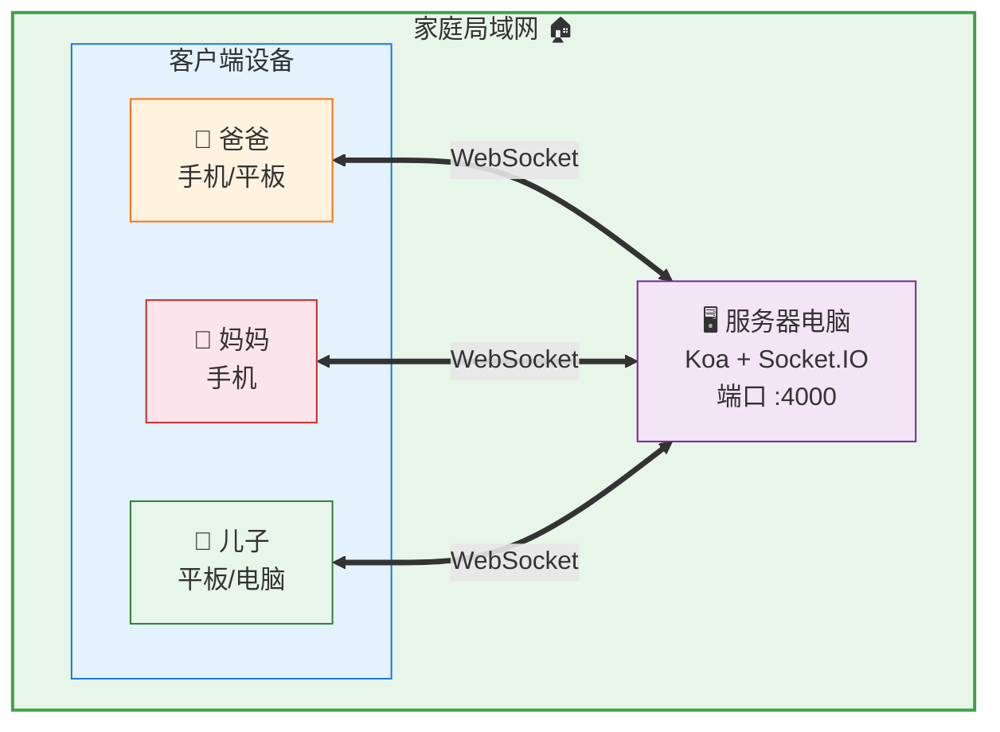
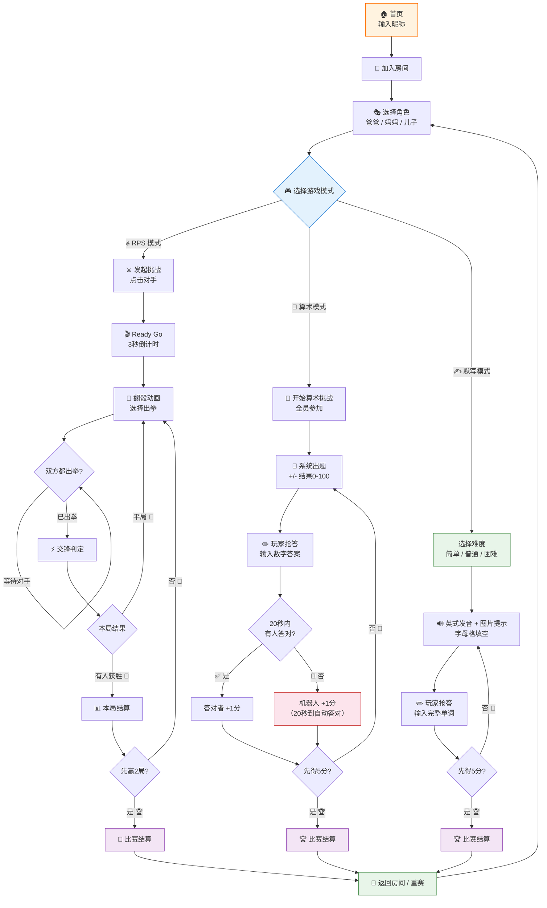

# Family War 🎮 v3.0

一个局域网多人游戏系统。目前可玩**石头剪刀布**（1v1 对战）、**算术达人**（全员抢答）和 v3.0 **爱拼才会赢**（英文默写），并支持机器人对局。

## 系统架构


```mermaid
graph TB
    subgraph 家庭局域网[家庭局域网 🏠]
        subgraph 客户端设备[客户端设备]
            D1[👨 爸爸<br>手机/平板] 
            D2[👩 妈妈<br>手机]
            D3[👦 儿子<br>平板/电脑]
        end
        S[🖥️ 服务器电脑<br>Koa + Socket.IO<br>端口 :4000]
    end

    D1 <==>|WebSocket| S
    D2 <==>|WebSocket| S
    D3 <==>|WebSocket| S

    style 家庭局域网 fill:#e8f5e9,stroke:#43a047,stroke-width:2px
    style 客户端设备 fill:#e3f2fd,stroke:#1976d2
    style D1 fill:#fff3e0,stroke:#ff6f00
    style D2 fill:#fce4ec,stroke:#c62828
    style D3 fill:#e8f5e9,stroke:#2e7d32
    style S fill:#f3e5f5,stroke:#7b1fa2
```

- 家人通过手机、平板或电脑的浏览器打开游戏页面（端口 3000）
- 所有设备通过家庭局域网连接到服务器电脑（端口 4000）
- 服务端运行 Koa HTTP 服务 + Socket.IO 实时通信
- 当前版本仅在局域网内使用，不发布互联网

## 游戏流程


```mermaid
flowchart TD
    A[🏠 首页<br>输入昵称] --> B[🚪 加入房间]
    B --> C[🎭 选择角色<br>爸爸 / 妈妈 / 儿子]
    C --> D{🎮 选择游戏模式}

    D -->|✊ RPS 模式| E[⚔️ 发起挑战<br>点击对手]
    E --> F[🎬 Ready Go<br>3秒倒计时]
    F --> G[🎰 翻骰动画<br>选择出拳]
    G --> H{双方都出拳?}
    H -->|等待对手| H
    H -->|已出拳| I[⚡ 交锋判定]
    I --> J{本局结果}
    J -->|平局 🔄| G
    J -->|有人获胜 🏅| K[📊 本局结算]
    K --> L{先赢2局?}
    L -->|否 🔄| G
    L -->|是 🏆| M[🎉 比赛结算]

    D -->|🧮 算术模式| N[🧮 开始算术挑战<br>全员参加]
    N --> O[📝 系统出题<br>+/- 结果0-100]
    O --> P[✏️ 玩家抢答<br>输入数字答案]
    P --> Q{20秒内<br>有人答对?}
    Q -->|✅ 是| R[答对者 +1分]
    Q -->|🤖 否| S[机器人 +1分<br>（20秒到自动答对）]
    R --> T{先得5分?}
    S --> T
    T -->|否 🔄| O
    T -->|是 🏆| U[🏆 比赛结算]

    D -->|✍️ 默写模式| Sp[选择难度<br>简单 / 普通 / 困难]
    Sp --> SpQ[🔊 英式发音 + 图片提示<br>字母格填空]
    SpQ --> SpA[✏️ 玩家抢答<br>输入完整单词]
    SpA --> SpR{先得5分?}
    SpR -->|否 🔄| SpQ
    SpR -->|是 🏆| SpM[🏆 比赛结算]

    M --> V[🔄 返回房间 / 重赛]
    U --> V
    SpM --> V
    V --> C

    style A fill:#fff3e0,stroke:#ff6f00
    style D fill:#e3f2fd,stroke:#1976d2
    style M fill:#f3e5f5,stroke:#7b1fa2
    style U fill:#f3e5f5,stroke:#7b1fa2
    style Sp fill:#e8f5e9,stroke:#2e7d32
    style SpM fill:#f3e5f5,stroke:#7b1fa2
    style S fill:#fce4ec,stroke:#c62828
    style V fill:#e8f5e9,stroke:#2e7d32
```

### 数据流向说明

```
┌─────────────────┐         Socket.IO          ┌──────────────────┐
│  客户端 A (👨)   │ ◄────────────────────────► │                  │
│  浏览器 :3000    │                            │  服务端 🖥️       │
│                 │  事件驱动双向通信            │  Koa :4000       │
│  客户端 B (👩)   │ ◄────────────────────────► │  Socket.IO       │
│  浏览器 :3000    │                            │                  │
│                 │  广播/单播/房间              │  内存状态        │
│  客户端 C (👦)   │ ◄────────────────────────► │  roomManager     │
│  浏览器 :3000    │                            │  gameManager     │
└─────────────────┘                            └──────────────────┘

       用户操作 → emit 事件          事件推送 → 更新UI
      (挑战/出拳/答题)              (state/roundResult/matchResult)
```

1. **用户操作** → 客户端 `socket.emit()` 发送事件到服务端
2. **服务端处理** → 更新内存状态（房间/角色/游戏），执行判定逻辑
3. **状态推送** → 服务端 `io.to(room).emit()` 或 `socket.emit()` 推送结果
4. **UI 更新** → 客户端收到事件后更新 React 组件状态，驱动界面变化

全部游戏状态在服务端内存中，客户端只做展示和操作输入，**服务端是唯一可信源**。

## 技术栈

| 层 | 技术 |
|------|------|
| 前端 | React 19 + Vite 6 + Antd v5 + JS |
| 后端 | Koa + @koa/router + JS |
| 实时通信 | Socket.IO（模块级单例，不依赖 React 生命周期） |
| UI 库 | Antd v5 |
| 测试框架 | 服务端 Jest；客户端 Vitest + React Testing Library |
| 测试策略 | TDD（先写测试后实现） |
| 管理接口 | Koa REST 路由 |
| 数据库 | 无（纯内存） |

## 目录结构

```
family-war/
├── client/                                   # React 前端 (端口 3000)
│   ├── public/
│   │   ├── favicon.svg
│   │   └── logo.svg
│   ├── index.html                              # Vite HTML 入口
│   ├── src/
│   │   ├── __tests__/                          # Vitest + React Testing Library
│   │   ├── pages/
│   │   │   ├── Home.jsx                       # 首页：输入昵称、加入房间
│   │   │   ├── Room.jsx                       # 房间：选角色、切模式、游戏入口
│   │   │   ├── Admin.jsx                      # 后台：房间状态 + 对局记录
│   │   │   └── WordConfig.jsx                 # 词库管理：章节/单词启用 + 图片同步/手动选图 + 语音播放（v3.0 新增）
│   │   ├── components/
│   │   │   ├── RoleCard.jsx                   # 角色卡片（空闲/选中/对战中）
│   │   │   ├── GameBoard.jsx                  # RPS 对战面板
│   │   │   ├── ArithmeticBoard.jsx            # 算术抢答面板
│   │   │   ├── SpellingBoard.jsx              # 默写抢答面板（图片、TTS、字母格）
│   │   │   ├── MatchResult.jsx                # 三种模式结算分发
│   │   │   ├── RpsMatchResult.jsx             # RPS 结算
│   │   │   ├── ArithmeticMatchResult.jsx      # 算术结算
│   │   │   └── SpellingMatchResult.jsx        # 默写终榜与逐题单词回顾
│   │   ├── hooks/
│   │   │   ├── __mocks__/
│   │   │   │   └── useSocket.js               # Socket mock（测试用）
│   │   │   └── useSocket.js                   # Socket.IO 模块级单例
│   │   ├── setup-vitest.js                    # Vitest/jsdom 全局测试配置
│   │   ├── App.jsx                            # 路由和 GameApp 状态容器
│   │   └── index.jsx
│   ├── jsconfig.json
│   ├── vite.config.js                         # Vite、代理、构建和测试配置
│   └── package.json
├── server/                         # Koa 后端 (端口 4000)
│   ├── __tests__/
│   │   ├── roomManager.test.js     # 房间和模式管理单元测试
│   │   ├── gameManager.test.js     # 三种游戏规则单元测试
│   │   ├── unsplashClient.test.js  # 图片同步单元测试
│   │   └── wordBank.test.js        # 词库配置校验单元测试
│   ├── tests/
│   │   └── integration.js          # 真实 Socket.IO 集成测试
│   ├── src/
│   │   ├── index.js                # Koa + Socket.IO 启动入口
│   │   ├── socket/
│   │   │   ├── handler.js          # 事件注册路由
│   │   │   ├── roomManager.js      # 房间/角色状态管理（内存）
│   │   │   └── gameManager.js      # 猜拳、算术和默写规则引擎
│   │   ├── data/
│   │   │   ├── words.json          # 默写词库（按章节组织，v3.0 新增）
│   │   │   ├── wordBank.js         # 词库加载 + 配置管理（读/写 word-config.json）
│   │   │   └── word-config.json    # 词库启用配置（不提交 git，v3.0 新增）
│   │   └── routes/
│   │       └── admin.js            # Koa REST 管理接口
│   ├── jsconfig.json               # VSCode JS 类型提示
│   └── package.json
└── package.json                    # 顶层 concurrent 启动
```

## 前端架构

```
App (BrowserRouter)
├── /admin → Admin
├── /admin/word-config → WordConfig
└── * → GameApp (状态容器)
    ├── roomState = null  →  Home
    │   └── onEnter(nickname) → emit room:join → setRoomState
    └── roomState ≠ null  →  Room
    ├── 选角色 / 切换游戏模式 (RPS / 算术 / 默写)
    ├── gameType === 'rps'        → GameBoard → RpsMatchResult
    ├── gameType === 'arithmetic' → ArithmeticBoard → ArithmeticMatchResult
    ├── gameType === 'spelling'   → SpellingBoard → MatchResult（暂用通用排名）
    └── onBack() → setRoomState(null) 返回首页
```

- Home 和 Room 之间没有 URL 切换，由 `GameApp` 的 state 控制渲染
- 刷新页面时 state 丢失，回退到 Home 界面，不产生死页面
- `socket.io` 客户端是模块级单例，不受 React 生命周期影响

## 游戏流程

### 石头剪刀布（v1.0）

```
首页(输入昵称) → 进入房间 → 选择角色 → 挑战 → Ready Go(首局) → 翻骰动画 → 出拳 → 结算
```

| 步骤 | 行为 | 通讯 |
|------|------|------|
| 进入房间 | 输入昵称，加入默认房间，开始播放大厅 BGM | `socket.emit('room:join', { nickname })` |
| 选角色 | 点击 爸爸/妈妈/儿子 角色卡，伴有选中/取消音效 | `socket.emit('role:select', { role })` |
| 发起挑战 | 选角后点击 ⚔️ 挑战按钮，伴有冲锋号角音效 | `socket.emit('game:challenge', { mode: 'rps', targetId })` |
| Ready Go | 比赛首局播放 3 秒倒计时动画，切换到对战 BGM | 客户端本地动画 |
| 翻骰动画 | 出拳阶段上方滚筒轮换 ✊✋✌️，伴有翻骰节拍音效 | 客户端本地动画 |
| 双方出拳 | 点击出拳按钮，滚筒定格 + punch 音效 → 交锋动画展示结果 | `socket.emit('game:move', { choice })` |
| 判定结果 | 服务器比对，广播本局结果 | 客户端收到 `game:roundResult` |
| 赛果 | 先赢 2 局者胜，切换到结算 BGM | 客户端收到 `game:matchResult` |
| 重赛 | 结算页点击“再来一局”，原对战双方重新开始 RPS | `socket.emit('game:rematch')` |

### 算术达人（v2.0）

```
选角色 → 切换算术模式 → 开始算术挑战 → 出题 → 抢答 → 结算
```

| 步骤 | 行为 | 通讯 |
|------|------|------|
| 切换模式 | 在房间内点击 "算术达人" 模式切换 | `socket.emit('game:setMode', { mode: 'arithmetic' })` |
| 开始游戏 | 点击 🧮 开始算术挑战按钮（需至少 1 人已选角色） | `socket.emit('game:challenge', { mode: 'arithmetic' })` |
| 出题 | 第一题随 `game:start` 下发（防竞争条件），后续题走 `game:question` 单独推送 | 客户端收到 `game:start.firstQuestion`（首题）或 `game:question`（后续） |
| 抢答 | 在输入框中填写答案并提交 | `socket.emit('game:answer', { questionId, answer })` |
| 判定 | 首位答对者得 1 分；机器人固定 20 秒后自动答对 | 客户端收到 `game:roundResult` |
| 赛果 | 先得 5 分者胜，切换到结算 BGM | 客户端收到 `game:matchResult` |
| 重赛 | 结算页点击“再来一局”，重新发起一场算术挑战 | `socket.emit('game:challenge', { mode: 'arithmetic' })` |

### 默写达人（v3.0）

```
选角色 → 切换默写模式并选择难度 → 开始默写挑战 → 听音/看图/填空 → 抢答 → 结算
```

| 步骤 | 行为 | 通讯 |
|------|------|------|
| 切换模式 | 房间内切换到“默写达人”，可选择简单、普通、困难三档 | `socket.emit('game:setMode', { mode: 'spelling', difficulty })` |
| 开始游戏 | 已选角色后点击“开始默写比赛”，所有已选角色玩家和机器人参赛 | `socket.emit('game:challenge', { mode: 'spelling' })` |
| 出题 | 首题随 `game:start` 下发，后续题走 `game:question`；自动朗读一次并可手动重播 | 题目包含 `ttsText`、填空、词长和图片 URL |
| 抢答 | 根据图片、英式发音和字母格输入完整单词；首位答对者得 1 分 | `socket.emit('game:answer', { questionId, answer })` |
| 结算 | 展示最终排名，并可展开回顾每题单词、填空提示和各玩家答案 | 客户端收到 `game:matchResult` |
| 管理能力 | 可配置章节/单词、同步图片、手动选图和试听英式发音 | `/admin/word-config` |
| 重赛 | 结算页重新发起默写挑战，服务端沿用房间当前难度并重新读取参赛角色 | `socket.emit('game:challenge', { mode: 'spelling' })` |

## 游戏规则

### 石头剪刀布

| 规则 | 内容 |
|------|------|
| 赛制 | 三局两胜（先赢 2 局者获胜） |
| 挑战 | 选角后点击下方 ⚔️ 挑战按钮 → 直接开始，无确认弹窗 |
| 平局 | 该局无效，双方不得分，继续下一局直到出现赢家 |
| 断线 | 立即结束比赛，整场比赛结果无效，双方回到房间空闲状态 |
| 记分 | 不计分，纯判定胜负 |

### 算术达人

| 规则 | 内容 |
|------|------|
| 参赛 | 所有已选角色的人类玩家 + 机器人，全员参加 |
| 题目 | 随机 +/- 计算题，结果范围 0-100，标准难度 |
| 答题 | 数字输入框填写答案，提交后不可修改 |
| 抢答 | 首位答对者得 1 分，其余玩家不得分 |
| 机器人 | 固定 20 秒后自动提交正确答案，若 20 秒内无人答对则机器人得 1 分 |
| 赛制 | 先得 5 分者获胜，游戏结束 |
| 断线 | 玩家断线不影响算术游戏继续（仍在局中不扣分） |

### 默写达人

| 规则 | 内容 |
|------|------|
| 参赛 | 所有已选角色的人类玩家 + 机器人，全员参加 |
| 题目 | 英文单词/词组默写，TTS 朗读 + Unsplash 图片示意；词库按教材章节组织 |
| 难度 | 简单（显露 ~50% 字母）/ 普通（显露 1-2 字母）/ 困难（全部隐藏）；词组中的空格始终可见 |
| 答题 | 逐格输入字母，填满自动提交；答完后正确字母转为静态展示，错误格显示绿色输入框内填正确字母，上方红字提示用户输入 |
| 抢答 | 首位答对者得 1 分，其余玩家不得分 |
| 机器人 | 根据难度自动提交（简单 40s / 普通 30s / 困难 20s），超时无人答对则机器人得 1 分 |
| 赛制 | 先得 5 分者获胜，游戏结束 |
| 词库 | 管理员可通过 `/admin/word-config` 选择启用的章节和单词 |
| 断线 | 玩家断线不影响默写游戏继续（仍在局中不扣分） |

### 通用规则

| 规则 | 内容 |
|------|------|
| 房间 | 默认 `default`，后期支持多房间（设计预留 roomId） |
| 角色 | 爸爸/妈妈/儿子/机器人，一人一角色，选了自动 ready。机器人角色不可被人类选择 |
| 模式切换 | 房间级切换，全体玩家在同一模式下游戏 |
| 旁观 | 暂不支持 |

## 机器人 🤖

房间中有一个**常驻机器人**，不可被人类选择，永远在线。

### 石头剪刀布模式

| 特性 | 说明 |
|------|------|
| 身份 | 虚拟玩家，占用 `'机器人'` 角色，ID 为 `__robot__` |
| 选择方式 | 和挑战其他玩家一样，在挑战列表中点击机器人即可发起对战 |
| 出牌策略 | 纯随机（rock/paper/scissors 等概率），无任何策略应对 |
| 出牌时机 | 人类出拳后，服务器即时为机器人出拳并结算，无等待 |
| 重赛/认输 | 和普通对局一样，支持重赛和认输 |
| 对局历史 | 与机器人的对局同样记录到对局历史和管理后台 |
| 角色卡片 | 机器人角色卡片为紫色主题(🤖)，始终不可点击 |

### 算术达人模式

| 特性 | 说明 |
|------|------|
| 参赛方式 | 自动参战，作为固定选手参与抢答 |
| 答题策略 | 固定 20 秒后自动提交正确答案 |
| 答题时机 | 每道题发题后启动 20s 定时器，20s 到立刻提交正确结果 |
| 计分 | 答对同样得 1 分，机器人也可能赢得整场比赛 |
| 对局历史 | 与人类的对局同样记录到对局历史和管理后台 |

### 默写达人模式

| 特性 | 说明 |
|------|------|
| 参赛方式 | 自动参战，作为固定选手参与抢答 |
| 答题策略 | 固定 20 秒后自动提交正确单词 |
| 答题时机 | 每道题发题后启动 20s 定时器，20s 到立刻提交正确结果 |
| 计分 | 答对同样得 1 分，机器人也可能赢得整场比赛 |
| 对局历史 | 与人类的对局同样记录到对局历史和管理后台 |

## 音效与背景音乐 🎵

### 背景音乐（BGM）

通过监听 `roomState.game.status` 自动切换三种 BGM，由 `App.jsx` 统一管理：

| 阶段 | 触发条件 | 文件路径 | 循环 |
|------|---------|---------|------|
| 大厅 | 进入房间 / 比赛结束返回 | `/bgm.mp3` | ✅ |
| 对战 | `game.status === 'playing'` | `/bgm_battle.mp3` | ✅ |
| 结算 | `game.status === 'match_end'` | `/bgm_result.mp3` | ✅ |

三首 BGM 均循环播放，音量 0.3。离开房间或组件卸载时自动停止。点击「返回房间」时主动切回大厅 BGM。

### UI 交互音效（Web Audio API）

所有 UI 音效由 Web Audio API 实时合成，无需外部音频文件：

| 音效 | 触发 | 实现 | 听感 |
|------|------|------|------|
| 选中角色 | 点击空闲角色卡 | 正弦波 C5↗E5，120ms | 「叮↑」积极肯定 |
| 取消角色 | 点击已选角色卡 | 正弦波 D5↘A4，120ms | 「叮↓」释放 |
| 挑战 | 点击 ⚔️ 挑战按钮 | 方波 150↗500Hz + 锯齿波 300↗1000Hz，250ms | 冲锋号角 |
| 出拳 | 点击出拳按钮 | 方波 100↘30Hz，180ms | 「砰」击打感 |
| 翻骰节拍 | 出拳滚筒每 2 次跳动 | 正弦波 800Hz，30ms | 微弱滴答节拍 |

技术细节：
- `getAudioContext(audioCtxRef)` — 复用单一 `AudioContext` 实例，自动处理浏览器 `suspended` 恢复
- `playSfx(audioCtxRef, freqStart, freqEnd, duration)` — 通用正弦波滑音
- `playBattleSfx(audioCtxRef)` — 双层波形合成（square + sawtooth）
- `playPunchSfx(audioCtxRef)` / `playRollTickSfx(audioCtxRef)` — 出拳阶段专用

### 音频文件部署

```
client/public/
├── bgm.mp3          # 大厅背景音乐
├── bgm_battle.mp3   # 对战背景音乐
├── bgm_result.mp3   # 结算背景音乐
└── readygo.mp3      # Ready Go 音效（≈3秒）
```

## Ready Go 动画 ⚡

每场**比赛首局**开始前播放 3 秒倒计时动画，参考泡泡龙风格：

```
0s        1.5s       2.5s      3s
├─ READY ─┤─ GO! ────┤ 淡出 ──┤ 进入出拳阶段
├────── readygo.mp3 播放 ──────────┤
```

- **READY**：金黄色 56px，弹缩入场（`readyGoBounceIn`：0.3→1.15→0.9→1.0）
- **GO!**：红色 72px，更大冲击力的弹缩入场
- **遮罩**：`position: fixed` 全屏半透明黑底（`rgba(0,0,0,0.6)`），GO 后 2.5s 开始渐隐出
- 仅比赛首局出现，后续局数直接进入出拳阶段
- 重赛时重新播放

## 出拳翻骰动画 🎰

`choosing` 阶段上方有一个独立滚筒区域，快速轮换 ✊→✋→✌️（120ms/次），下方三个出拳按钮保持静态：

```
     ┌──────────────┐
     │     ✊       │  ← 120ms 快速轮换 + 翻骰节拍音效
     │  👆 选一个出拳 │
     └──────────────┘

   [✊ 石头]  [✋ 布]  [✌️ 剪刀]   ← 静态按钮，hover 高亮
```

点击后：滚筒定格在选中 emoji（放大 + 绿色光晕 + `rollStop` 弹跳动画）+ punch 音效 → 350ms 后进入 waiting。

## 协议设计（v2.0）

v2.0 采用**复用事件 + gameType 分流**策略，不新增事件命名空间：

- `game:start` / `game:roundResult` / `game:matchResult` / `game:waiting` / `game:forfeited` 全部复用
- 每个事件增加 `gameType: 'rps' | 'arithmetic' | 'spelling'` 字段区分模式
- 仅新增 2 个事件：`game:question`（S→C 出题）、`game:answer`（C→S 答题）
- `game:challenge` 通过 `mode` 分流；RPS 可省略并默认使用 `rps`，算术和默写需显式传入模式
- `game:rematch` 不是三种模式的通用重赛事件，目前只用于 RPS

### 重赛机制

| 模式 | 客户端事件 | 服务端行为 | 当前状态 |
|------|------------|------------|----------|
| RPS | `game:rematch` | 取已结束比赛的原两名玩家，创建新的 RPS 比赛 | 已完成 |
| 算术 | `game:challenge { mode: 'arithmetic' }` | 清除已结束比赛，按当前已选角色重新创建全员算术比赛 | 已完成 |
| 默写 | `game:challenge { mode: 'spelling' }` | 清除已结束比赛，按当前已选角色和房间难度重新创建默写比赛 | 已完成 |

算术和默写采用“重新发起挑战”而不是 `game:rematch`，因为两者是全员模式，重赛时应重新读取当前角色阵容；默写还需要读取房间当前的 `spellingDifficulty`。

### Socket 事件清单

#### 客户端 → 服务端

| 事件 | 数据 | 说明 |
|------|------|------|
| `room:join` | `{ nickname, roomId? }` | 加入默认房间 |
| `room:leave` | — | 离开 |
| `role:select` | `{ role }` | 选角色（爸爸/妈妈/儿子，机器人不可选） |
| `role:deselect` | — | 放弃当前角色 |
| `game:setMode` | `{ mode: 'rps' \| 'arithmetic' \| 'spelling', difficulty?: 'easy' \| 'normal' \| 'hard' }` | 切换房间游戏模式 |
| `game:challenge` | RPS: `{ targetId, mode?: 'rps' }`<br>算术: `{ mode: 'arithmetic' }`<br>默写: `{ mode: 'spelling' }` | 发起挑战或全员模式重赛 |
| `game:move` | `{ choice }` | 出拳（rock/paper/scissors） |
| `game:answer` | RPS: `{ choice }`<br>算术/默写: `{ questionId, answer }` | 出拳或抢答 |
| `game:rematch` | `{ roomId? }` | 仅用于 RPS：原对战双方再来一局 |
| `game:forfeit` | — | 认输回房 |

#### 服务端 → 客户端

| 事件 | RPS 数据 | 算术数据 | 默写数据 |
|------|----------|----------|----------|
| `room:state` | `{ ..., gameMode: 'rps' }` | `{ ..., gameMode: 'arithmetic' }` | `{ ..., gameMode: 'spelling', spellingDifficulty: 'easy' \| 'normal' \| 'hard' }` |
| `player:joined` | `{ nickname }` | 相同 | 相同 |
| `player:left` | `{ socketId }` | 相同 | 相同 |
| `game:start` | `{ gameType: 'rps', opponent, round }` | `{ gameType: 'arithmetic', players: [...], round, firstQuestion: { questionId, expression, round } }` | `{ gameType: 'spelling', players: [...], round, difficulty, firstQuestion: { questionId, ttsText, wordLength, blanks, unsplashImageUrl, round } }` |
| `game:question` | — | `{ questionId, expression, round }` | `{ questionId, ttsText, wordLength, blanks, unsplashImageUrl, round }` |
| `game:waiting` | 等待对手出拳 | 等待其他人 / 机器人倒计时 | 等待其他人 / 机器人倒计时 |
| `game:roundResult` | `{ round, winner, yourMove, oppMove, scores }` | `{ gameType: 'arithmetic', round, questionId, expression, correctAnswer, yourAnswer, winner, scores }` | `{ gameType: 'spelling', round, questionId, word, blanks, correctAnswer, yourAnswer, winner, scores }` |
| `game:matchResult` | `{ gameType: 'rps', matchWinner, scores, history }` | `{ gameType: 'arithmetic', matchWinner, scores, ranking, history }` | `{ gameType: 'spelling', matchWinner, scores, ranking, history }` |
| `game:cancelled` | `{ message }` | 相同 | 相同 |
| `game:forfeited` | `{ message }` | 相同 | 相同 |
| `game:error` | `{ message }` | 相同 | 相同 |
| `game:answerAck` | — | `{ questionId, correct, correctAnswer, expression, yourAnswer }` | `{ questionId, correct, correctAnswer, word, yourAnswer }` |

### room:state 新增字段

```json
{
  ...原有字段,
  "gameMode": "rps" | "arithmetic" | "spelling",
  "spellingDifficulty": "easy" | "normal" | "hard"  // ← v3.0 新增
}
```

## MatchResult 架构

v2.0 将 `MatchResult.jsx` 重构为内部根据 `gameType` 分发子组件，预留未来扩展：

```
MatchResult.jsx
├── 接收完整 data（含 gameType）
├── Modal 壳（antd Modal）
├── 内部 switch:
│   ├── gameType === 'arithmetic' → <ArithmeticMatchResult />
│   ├── gameType === 'spelling'   → <SpellingMatchResult />
│   └── default (rps)            → <RpsMatchResult />
```

- `RpsMatchResult` — 历史回放 + 🏆/😢 + 比分
- `ArithmeticMatchResult` — 终榜排名（🥇🥈🥉）+ 每题回放
- `SpellingMatchResult` — 终榜排名 + 每题单词/填空/玩家答案回顾

## 后台管理

无数据库，当前提供纯监控页面 + 词库管理接口：

> 当前管理接口没有身份认证，CORS 也未限制来源，仅适合可信局域网。安全加固计划见 `step.md` 的“后续 TODO：管理接口安全加固”。

- 当前房间状态（谁在线、选了谁、是否对战中）
- 已完成对局记录（存在内存数组中）
- API: `GET /api/admin/status` → 房间列表 + 历史对局
- API: `GET /api/admin/word-config` → 章节结构 + 图片同步状态 + 当前启用配置
- API: `POST /api/admin/word-config` → 校验并保存词库启用配置（至少保留一个可用单词）
- API: `GET /api/admin/word-images/candidates/:word?page=1&perPage=15` → 候选图片列表（支持翻页）
- API: `POST /api/admin/word-images/confirm/:word` → 确认选中图片并下载保存
- API: `POST /api/admin/word-images/replace/:word` → 替换单张 Unsplash 图片（随机选，UI 已不使用）
- API: `GET /api/admin/word-images/status` → 图片同步状态
- API: `POST /api/admin/word-images/sync` → 触发全量图片同步（UI 已隐藏）
- API: `POST /api/admin/word-images/sync-missing` → 仅同步缺失图片

## 测试

| 项目 | 说明 |
|------|------|
| 框架 | 服务端 Jest v29；客户端 Vitest v3 + jsdom |
| 服务端单元测试 | `server/__tests__/roomManager.test.js`、`gameManager.test.js`、`unsplashClient.test.js`、`wordBank.test.js` |
| 服务端集成测试 | `server/tests/integration.js`（真实 Socket 连接走完整流程） |
| 前端单元测试 | `client/src/__tests__/*.test.jsx`（Vitest + React Testing Library + Antd） |
| 类型 | `@types/jest` + `jsconfig.json` 提供 VSCode 智能提示 |

### 运行测试

```bash
# 服务端和客户端单元测试（根目录并行运行）
npm test

# 服务端单元测试（watch 模式）
npm test:watch --prefix server

# 服务端集成测试
npm run test:integration

# 前端单元测试
npm test --prefix client
```

### 测试覆盖

| 分组 | 模块 | 类型 | 用例数 |
|------|------|------|--------|
| joinRoom / leaveRoom | roomManager | 单元 | 5 |
| selectRole / deselectRole | roomManager | 单元 | 7 |
| handleDisconnect | roomManager | 单元 | 3 |
| getRoomState | roomManager | 单元 | 2 |
| broadcastRoomState | roomManager | 单元 | 2 |
| getAdminStatus | roomManager | 单元 | 3 |
| setGame / clearGame | roomManager | 单元 | 3 |
| setGameMode | roomManager | 单元 | 7 |
| createGame | gameManager | 单元 | 1 |
| submitMove | gameManager | 单元 | 11 |
| handleDisconnect | gameManager | 单元 | 4 |
| getGame | gameManager | 单元 | 3 |
| getMatchHistory | gameManager | 单元 | 3 |
| 算术 createGame | gameManager | 单元 | 1 |
| generateQuestion | gameManager | 单元 | 3 |
| submitArithmeticAnswer | gameManager | 单元 | 10 |
| 算术 5 分赛制 | gameManager | 单元 | 6 |
| handleRobotArithmeticAnswer | gameManager | 单元 | 4 |
| Socket 游戏流程（RPS + 算术 + 默写完整比赛及重赛） | handler | 集成 | 81 |
| Home 渲染 + 回调 | client Home | 前端单元 | 5 |
| Room 渲染 + 交互 | client Room | 前端单元 | 14 |
| RoleCard 渲染 + 交互 | client RoleCard | 前端单元 | 7 |
| Admin 渲染 + 数据 | client Admin | 前端单元 | 3 |
| ArithmeticBoard 渲染 + 交互 | client ArithmeticBoard | 前端单元 | 13 |
| ArithmeticMatchResult 渲染 + 交互 | client ArithmeticMatchResult | 前端单元 | 9 |
| WordConfig 非空防守 + 图片状态独立更新 + 保存 + 语音播放 | client WordConfig | 前端单元 | 10 |
| SpellingBoard 渲染 + 首题倒计时 + 异步 TTS 音色 + 答题 + 事件 + 重赛 | client SpellingBoard | 前端单元 | 13 |
| SpellingMatchResult 胜负 + 排名 + 单词回顾 + 操作 | client SpellingMatchResult | 前端单元 | 3 |
| **服务端单元** | | | **154** |
| **集成** | | | **81** |
| **前端单元** | | | **77** |
| **总计** | | | **312** |

## 端口

| 服务 | 端口 |
|------|------|
| client (React) | 3000 |
| server (Koa) | 4000 |

- **server**: 4000（Koa + Socket.IO）
- **client**: 3000（React 开发服务器）
- 开发环境下 socket.io 客户端通过 `window.location.hostname` 动态拼接服务器地址，支持局域网 IP 访问；当前 CORS 全开放，仅适合可信局域网
- `/api` 和 `/socket.io` 由 Vite 开发服务器代理到 4000


完整的实现步骤（v1.0 / v2.0 / v2.1 / v3.0）请参阅 [`step.md`](step.md)。

## 生产部署

### 端口说明

| 实例 | 端口 | 用途 |
|------|------|------|
| 开发 | 4000 | 开发环境，nodemon 热重载 |
| 集成测试 | 4001 | `npm run test:integration` |
| 预发布 | 4010 | PM2 管理，生产配置 |

### PM2 部署

**目标**：服务端脱离 nodemon，用 PM2 管理预发布实例。

**实施内容**

| # | 事项 | 说明 |
|---|------|------|
| 1 | 安装 PM2 | `npm i -g pm2`（如未安装） |
| 2 | 创建 `server/ecosystem.config.js` | 端口 4010，`NODE_ENV=production`，不开启 watch |
| 3 | 启动预发布实例 | `pm2 start server/ecosystem.config.js` |
| 4 | 验证 | `curl http://localhost:4010/api/health` → `{"status":"ok"}` |
| 5 | 日常同步 | 开发验证后 → `pm2 restart family-war-server` 更新预发布 |

**PM2 配置**（`server/ecosystem.config.js`）：

```js
module.exports = {
  apps: [{
    name: 'family-war-server',
    script: 'src/index.js',
    cwd: __dirname,
    env: { PORT: 4010, NODE_ENV: 'production' },
    instances: 1,
    exec_mode: 'fork',
    max_restarts: 5,
    error_file: '../logs/server-err.log',
    out_file: '../logs/server-out.log',
  }]
}
```

**重要**：PM2 不添加 `watch` 模式，开发时文件变更不会意外重启预发布服务。需要同步最新代码时手动执行 `pm2 restart family-war-server`。

**管理命令**

| 命令 | 作用 |
|------|------|
| `pm2 start server/ecosystem.config.js` | 启动预发布服务（:4010） |
| `pm2 stop family-war-server` | 停止 |
| `pm2 restart family-war-server` | 重启（同步最新代码后执行） |
| `pm2 logs family-war-server` | 查看实时日志 |
| `pm2 status` 或 `pm2 list` | 查看进程状态 |

**开机自启**（仅首次需要）：

```bash
pm2 startup    # 生成自启脚本（需要 sudo，按提示执行）
pm2 save       # 保存当前进程列表
```

### Nginx 配置

**目标**：添加 `/family-war` 路由，代理静态文件和 API/WebSocket 到预发布后端。

**实施内容**

| # | 事项 | 说明 |
|---|------|------|
| 1 | 创建 `/opt/homebrew/etc/nginx/servers/conf.d/family-war.conf` | 见下方配置 |
| 2 | 验证语法 | `nginx -t` |
| 3 | 重载 nginx | `nginx -s reload` |
| 4 | 全链路验证 | 访问 `http://localhost:8080/family-war/`，确认页面/API/WebSocket 均正常 |

**Nginx 配置**：

```nginx
# 301 redirect /family-war -> /family-war/
location = /family-war {
    return 302 /family-war/;
}

# 静态文件服务 + SPA fallback（BrowserRouter）
location /family-war/ {
    alias /Users/guhui/Githubs/family-war/client/build/;
    index index.html;
    try_files $uri $uri/ /family-war/index.html;
}

# API 反向代理（自动剥离 /family-war 前缀）
location /family-war/api/ {
    proxy_pass http://localhost:4010/api/;
    proxy_set_header Host $host;
    proxy_set_header X-Real-IP $remote_addr;
}

# Socket.IO WebSocket 代理
location /family-war/socket.io/ {
    proxy_pass http://localhost:4010/socket.io/;
    proxy_http_version 1.1;
    proxy_set_header Upgrade $http_upgrade;
    proxy_set_header Connection "upgrade";
    proxy_set_header Host $host;
    proxy_set_header X-Real-IP $remote_addr;
}
```

### 环境对照

| 层级 | 开发环境 | 预发布环境 |
|------|----------|------------|
| 前端服务 | Vite dev server `:3000`（热更新） | Nginx `:8080/family-war/`（静态文件） |
| 后端进程 | nodemon `:4000`（自动重启） | PM2 `:4010`（手动重启） |
| API 入口 | `http://localhost:3000/api/*`（Vite 代理） | `http://localhost:8080/family-war/api/*`（nginx 反代） |
| Socket.IO | 直连 `http://{host}:4000` | nginx 反代 `/family-war/socket.io` → `:4010` |
| 配置文件 | `client/vite.config.js` | `nginx conf.d/family-war.conf` |
